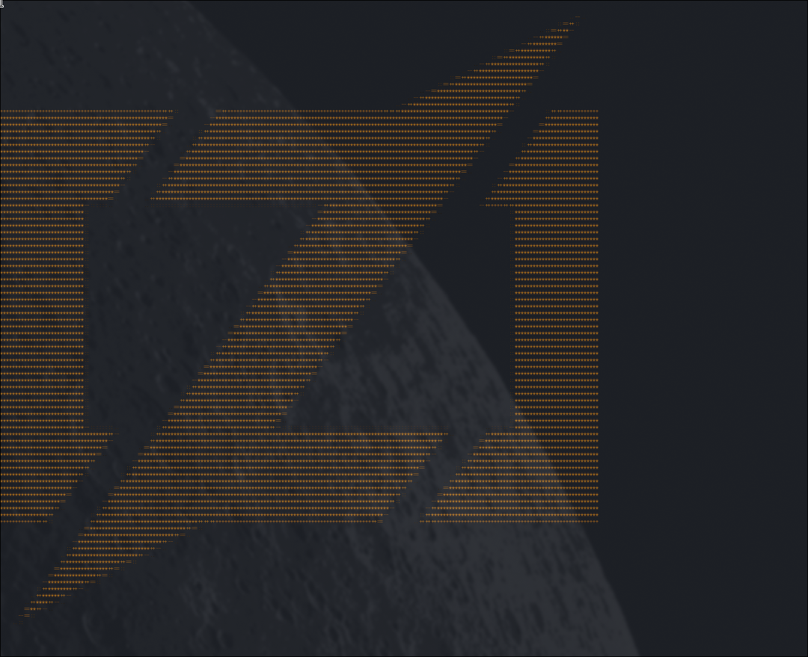
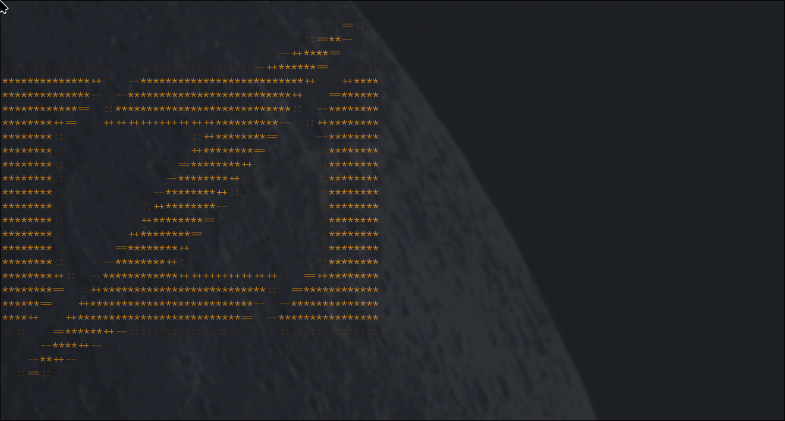

# bimg

A CLI tool that renders images as colored ASCII art in the terminal using [ImageMagick](https://imagemagick.org/).

<p align="center">
  
</p>

## Features

- Renders any image format supported by ImageMagick (PNG, JPG, GIF, WebP, etc.)
- Preserves original colors using 24-bit ANSI true-color escape codes
- Maintains aspect ratio automatically
- Configurable output width (default: 120 columns)

## Installation

### From Source

**Requirements:**
- [Zig](https://ziglang.org/) 0.13.0
- [ImageMagick](https://imagemagick.org/) (with `magick` command available)

```bash
git clone https://github.com/yourusername/bimg.git
cd bimg
zig build -Doptimize=ReleaseFast
./zig-out/bin/bimg <image-path>
```

### NixOS (Flake)

If you have a flake-enabled NixOS configuration, add bimg as an input:

```nix
{
  description = "My NixOS configuration";

  inputs = {
    nixpkgs.url = "github:NixOS/nixpkgs/nixos-unstable";
    bimg.url = "github:yourusername/bimg";
    bimg.inputs.nixpkgs.follows = "nixpkgs";
  };

  outputs = { self, nixpkgs, bimg, ... }: {
    nixosConfigurations.myhost = nixpkgs.lib.nixosSystem {
      system = "x86_64-linux";
      modules = [
        ./configuration.nix
        {
          environment.systemPackages = [
            bimg.packages.x86_64-linux.default
          ];
        }
      ];
    };
  };
}
```

Then rebuild:

```bash
sudo nixos-rebuild switch --flake .#myhost
```

### NixOS (Non-Flake / Channels)

Less common now, but if your system isn't flake-enabled yet, you can still pull a flake output via `builtins.getFlake` (needs `experimental-features = nix-command flakes` enabled, even outside a flake context):

```nix
{ config, pkgs, ... }:
let
  bimgFlake = builtins.getFlake "github:yourusername/bimg";
in
{
  environment.systemPackages = [
    bimgFlake.packages.x86_64-linux.default
  ];
}
```

Then rebuild as usual:

```bash
sudo nixos-rebuild switch
```

## Usage

```bash
bimg <image-path> [max-width]
```

**Arguments:**

| Argument     | Description                                    | Default |
|-------------|------------------------------------------------|---------|
| `image-path` | Path to the input image file                   | (required) |
| `max-width`  | Maximum terminal columns for output            | `120`   |

## Examples

### Basic Usage

Render an image at default width (120 columns):

```bash
bimg images/nixoslogo.png
```

### Custom Width

Render at 50 columns wide:

```bash
bimg images/nixoslogo.png 50
```

### Output

The tool outputs each pixel as two colored ASCII characters, preserving the original colors:

<p align="center">
  
</p>

### Zig Logo Examples

Different sizes of the Zig logo:

<p align="center">
  
  <br>
  <em>Zig logo rendered at 100 columns</em>
</p>

<p align="center">
  
  <br>
  <em>Zig logo rendered at 30 columns</em>
</p>

## How It Works

1. **Query dimensions** — Uses `magick identify` to get the source image's real dimensions
2. **Calculate size** — Scales the image to fit within the terminal width while preserving aspect ratio
3. **Convert to BMP** — Converts and resizes the image to a temporary BMP file via ImageMagick
4. **Read pixels** — Parses the BMP file, handling bottom-up row order and row padding
5. **Render** — Maps each pixel's luminance to an ASCII character and applies 24-bit ANSI color codes

## License

MIT
